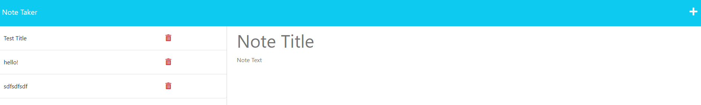

# 11-Note-Taker

## Description
This project was created to provide users with an online notepad. This notepad can be used to make lists, short notations, or to jot down reminders. This was also built to help develop skills in Express js.
The challenges I encountered were mainly learning how to deploy the application and how to make the routes work with the main server.js file. 

## Table of Contents

- [Installation](#installation)
- [Usage](#usage)
- [Credits](#credits)
- [License](#license)

## Installation

To install this application:
1. Copy the started code
2. Navigate to the Develop folder
3. In your terminal type npm i -y to install node
4. After, type the command npm install express to install express.js
5. Run command node server.js
6. Copy the port item and paste it in your preferred browser, this should bring up the application. 

## Usage
Once node js and Express have been installed,
1. Open the app in your browser
2. Enter a title and your note
3. Click on the floppy disk icon to save your note, your note will then appear on the left column

GitHub link:https://github.com/Volcomix13/11-Note-Taker

https://dashboard.heroku.com/apps/note-tracker13

## Credits

## License
Please see repository for license info